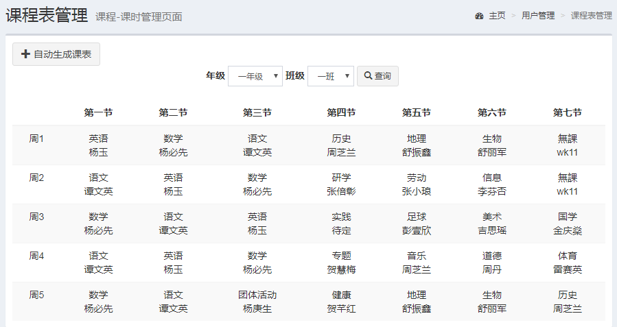

# ziyu_lesson_auto

ziyu_lesson_auto 是基于开源项目Wetech-Admin[https://github.com/cjbi/wetech-admin] 的基础上修改而成， 项目是基于 Spring Boot 2.0 + Mybatis 的轻量级后台管理系统，适用于中小型项目的管理后台以及小学，初中和高中课程智能排课管理，支持按钮级别的权限控制，系统具有最基本的用户管理、角色管理、资源管理、组织机构管理、系统日志、代码生成器等通用性功能。

学校排课问题本质上是时间表问题的一类典型应用实例，是为了解决课程安排对时间和空间资源的有效利用并避免相互冲突。在排课过程中，需要考虑课程教学效果、满足教师特殊要求等多项优化指标，将各门课程安排到相应的时间和教室（教室安排功能尚未实现）。

## 技术选型

### 后端技术

技术 | 名称 | 版本 | 官网
----|------|----|----
Spring Boot | 应用框架 | 2.0.0.RELEASE | [https://projects.spring.io/spring-boot/](https://projects.spring.io/spring-boot/)
MyBatis | ORM框架 | 3.2.1 |  [http://www.mybatis.org/mybatis-3/zh/index.html](http://www.mybatis.org/mybatis-3/zh/index.html)
Mapper | MyBatis 通用 Mapper4 | 4.0.0 |  [https://gitee.com/free/Mapper](https://gitee.com/free/Mapper)
PageHelper | MyBatis 分页插件 | 5.1.2 |  [https://gitee.com/free/Mybatis_PageHelper](https://gitee.com/free/Mybatis_PageHelper)
Maven | 项目构建管理 | 4.0.0 |  [http://maven.apache.org](http://maven.apache.org/)
MyBatis Generator | 代码生成 | 1.3.5 |  [http://www.mybatis.org/generator/index.html](http://www.mybatis.org/generator/index.html)
Thymeleaf | 模板引擎 | 3.0.9.RELEASE |  [https://www.thymeleaf.org/](https://www.thymeleaf.org/)
Apache Shiro | 安全框架 | 1.2.2 |  [http://shiro.apache.org](http://www.mybatis.org/generator/index.html)
Logback | 日志组件 | 1.1.3 |  [https://logback.qos.ch](https://logback.qos.ch/)
Druid | 数据库连接池 | 0.2.23 |  [https://github.com/alibaba/druid](https://github.com/alibaba/druid)
swagger2 | 在线文档生成 |  2.9.2 | [https://swagger.io/](https://swagger.io/) 

### 前端技术

技术 | 名称 | 版本 |  官网
----|------|----|----
jQuery | 优秀的Javascript库 | 3.2.1 |  [http://jquery.com/](http://jquery.com/)
Admin-LTE| 基于Bootstrap的前端框架 | 3.0.0 |  [https://adminlte.io/](https://adminlte.io/)
Bootstrap Table | 数据表格 | 1.10.16 |  [http://bootstrap-table.wenzhixin.net.cn/zh-cn/getting-started/](http://bootstrap-table.wenzhixin.net.cn/zh-cn/getting-started/)
Layer | jQuery弹出层插件 | 3.1.0 |  [http://layer.layui.com/](http://layer.layui.com/)
ZTree | jQuery树插件 | 3.5.29 |  [http://www.treejs.cn](http://www.treejs.cn)

## 软件需求

- JDK1.8+
- MySQL5.6+
- Maven3.0+

## 本地部署

- 通过git下载源码
- 创建数据库wetech_admin，数据库编码为UTF-8
- 执行docs/sql/wetech_admin.sql，初始化数据
- 修改application-dev.properties文件，更新MySQL账号和密码
- 运行Maven命令mvn install
- 运行ZiyuAdminApplication类
- 项目访问路径：http://localhost:8888/ziyu-admin Swagger文档路径：http://localhost:8888/ziyu-admin/swagger-ui.html
- 账号密码：admin/123456

## 预览图

> 课程表显示

